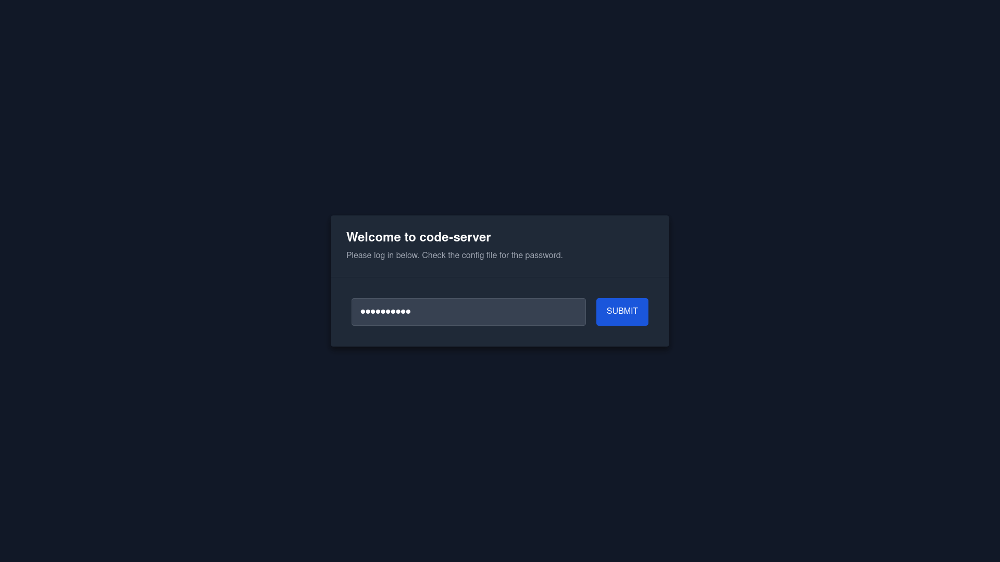
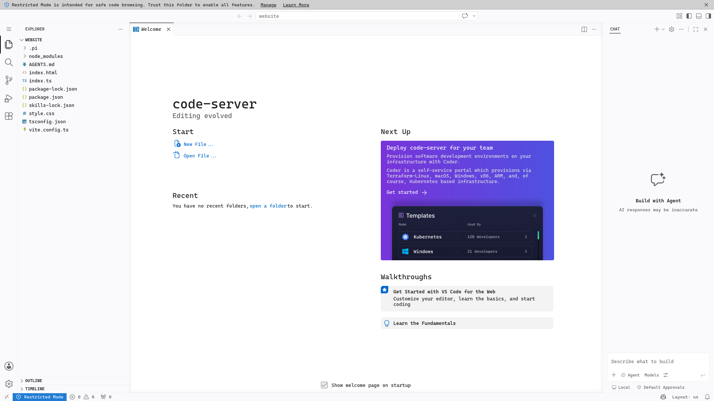
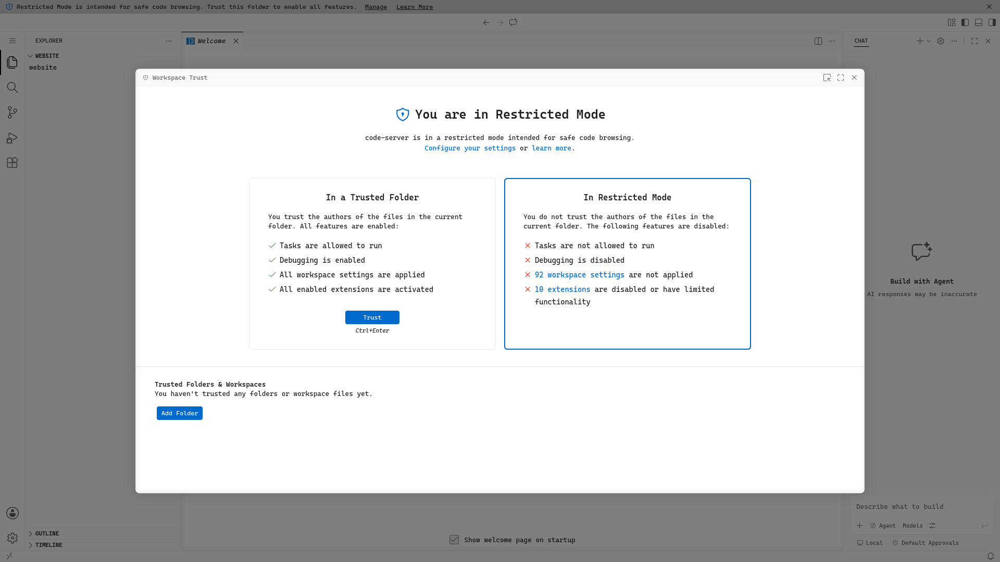
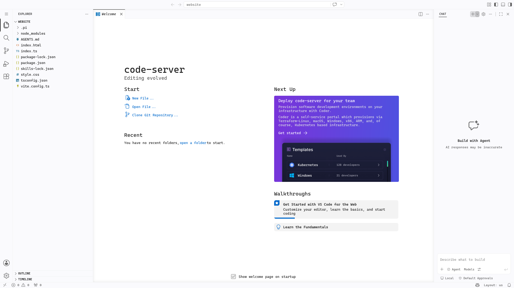
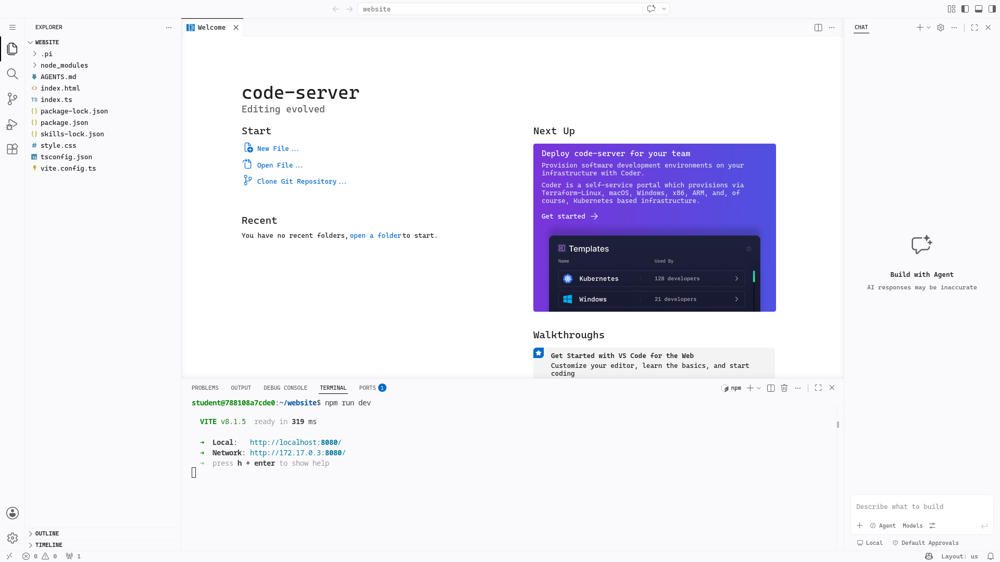
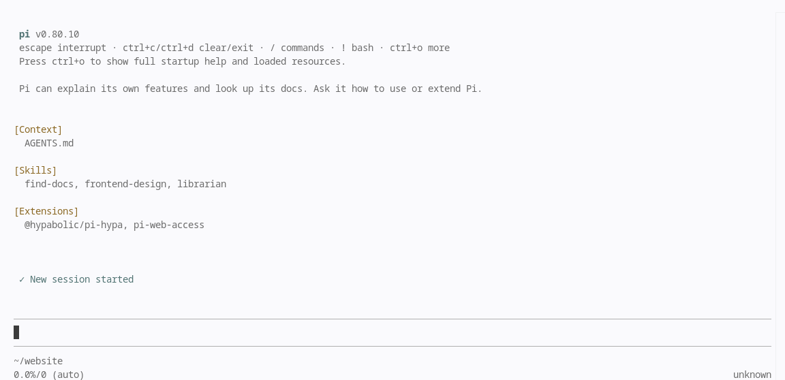

## Schritt 1: Anmeldung

Du bekommst, solltest du dich für die Online-Entwicklungsumgebung angemeldet haben, beim Eingang des Hackathons einen Zettel mit einem Shortcode. Diesen Shortcode kannst du auf dieser Webseite auf [der Redeem-Seite](../../redeem/) eingeben, um die Zugangsdaten für die Online-Entwicklungsumgebung zu erhalten. Die Zugangsdaten sehen so aus:

```plaintext
Environment 1  (vcenv-local-1)
  Code Server        : XXXXXXXXXX
  Password           : XXXXXXXXXX
  Dev server         : XXXXXXXXXX
  Container shell    : XXXXXXXXXX
```

Rufe den Link bei "Code Server" in deinem Browser auf und gib das Passwort ein, um dich anzumelden. Du solltest nun die Online-Entwicklungsumgebung sehen.





Als nächstes musst du dem offenen Ordner "vertrauen". Klicke dazu in der Leiste ganz oben auf "Manage" und dann auf "Trust". Danach kannst du die Entwicklungsumgebung nutzen.





Öffne nun das Terminal, indem du in der Leiste ganz oben rechts auf das horizontal gespaltete Rechteck klickst. Du solltest nun ein Terminal-Fenster sehen, in dem du Befehle eingeben kannst.

Gib `npm run dev` ein, um den Entwicklungsserver zu starten. Du solltest nun eine Meldung sehen, dass der Server läuft.



Öffne den Link bei "Dev server" in den Anmeldedaten der Redeem-Seite in deinem Browser, um die Webseite zu sehen, die du gerade entwickelst. Du solltest nun die Startseite der Webseite sehen.


Nun startest du den Coding-Agent pi.dev. Klicke im Terminal auf das kleine Plus-Zeichen, um ein neues Terminal zu öffnen. Gib dort `pi` ein und drücke Enter. Drücke die Enter-Taste, um pi zu erlauben, auf den geöffneten Ordner zuzugreifen.



Als nächstes wirst du lernen, wie du pi.dev benutzen kannst, um deine Webseite oder ein anderes Projekt zu entwickeln. Rufe dazu das Tutorial [Arbeiten mit pi.dev](../pi-dev/) auf.
