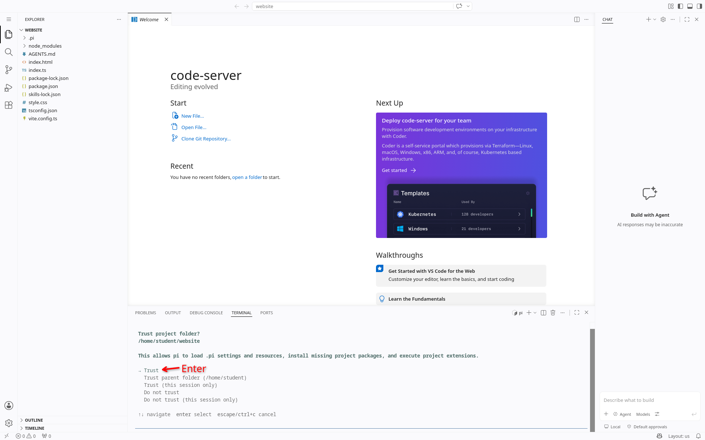
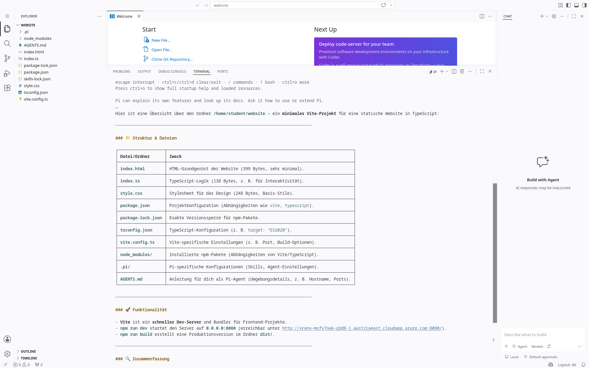

## Schritt 1: Anmeldung

Wenn ihr euch für die Online-Entwicklungsumgebung angemeldet habt, bekommt ihr
beim Eingang des Hackathons einen Zettel mit einem Shortcode. Gebt diesen Code
auf [der Redeem-Seite](../../redeem/) ein, um die Zugangsdaten für eure
Online-Entwicklungsumgebung zu erhalten. Die Zugangsdaten sehen so aus:

```plaintext
Environment 1  (vcenv-local-1)
  Code Server        : XXXXXXXXXX
  Password           : XXXXXXXXXX
  Dev server         : XXXXXXXXXX
  Container shell    : XXXXXXXXXX
```

Ruft den Link bei „Code Server“ im Browser auf und gebt das Passwort ein.


## Schritt 2: Entwicklungsumgebung einrichten

Jetzt müsst ihr den Ordner öffnen, in dem ihr arbeiten wollt. Klickt dazu auf Drei Striche → File → Open Folder und wählt den Ordner `website` aus.


Als Nächstes müsst ihr dem offenen Ordner vertrauen. Klickt oben auf „Manage“
und dann auf „Trust“.


Öffnet nun über das horizontal geteilte Rechteck oben rechts ein Terminal.


Gebt `npm run dev` ein, um den Entwicklungsserver zu starten.


Öffnet den Link bei „Dev server“ aus euren Zugangsdaten, um die Webseite zu
sehen, an der ihr gerade arbeitet.


Öffnet über das Plus-Zeichen ein zweites Terminal, gebt `pi` ein und bestätigt,
dass pi.dev auf den geöffneten Projektordner zugreifen darf.



Fragt zum Beispiel nach, was die Dateien im Ordner `website` machen, und ihr bekommt eine Antwort von pi.dev.

> Erkläre die Dateien in diesem Ordner.



## Weitere Schritte

Wie ihr den Agent sinnvoll steuert, erfahrt ihr im nächsten Tutorial „Vibe Coding und Prompts“.
