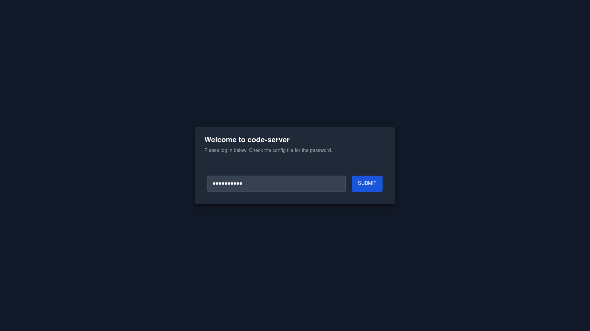
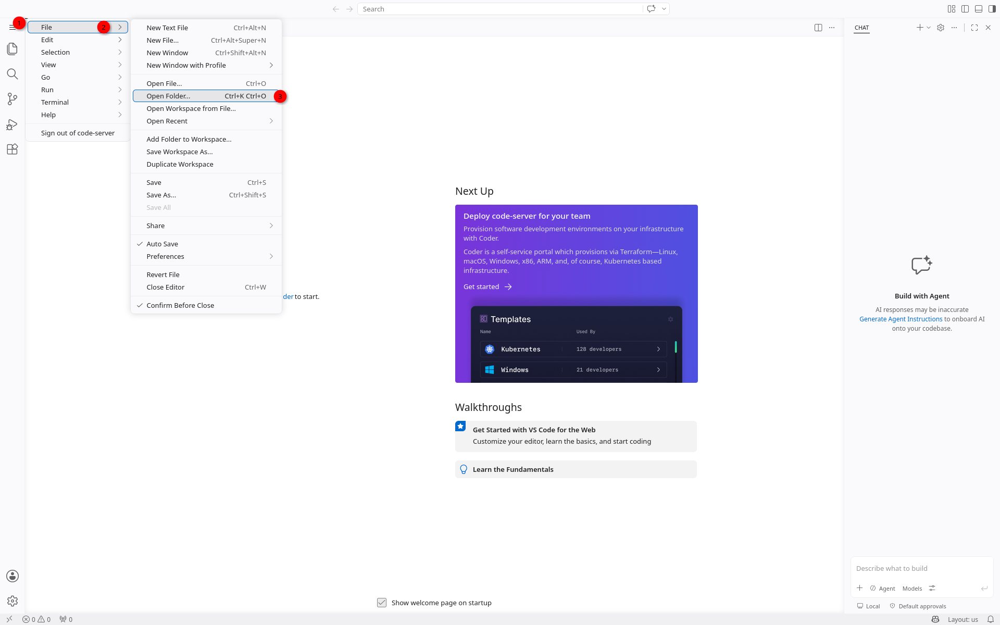
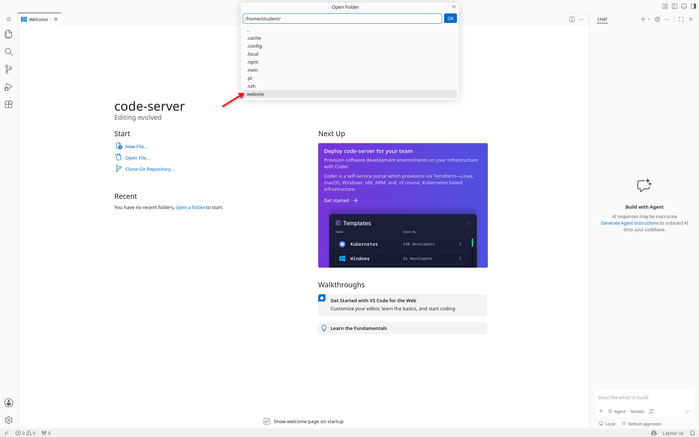
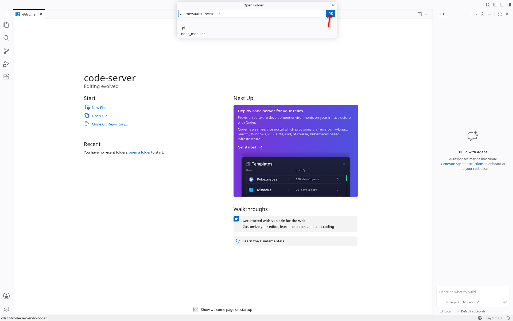
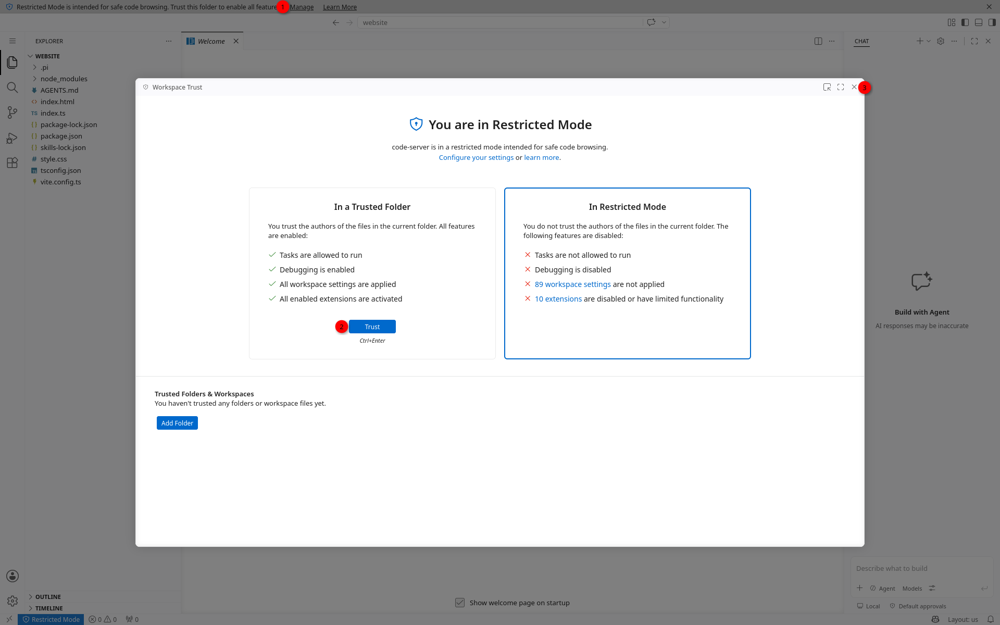
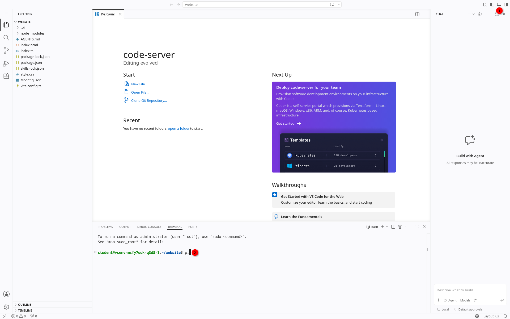
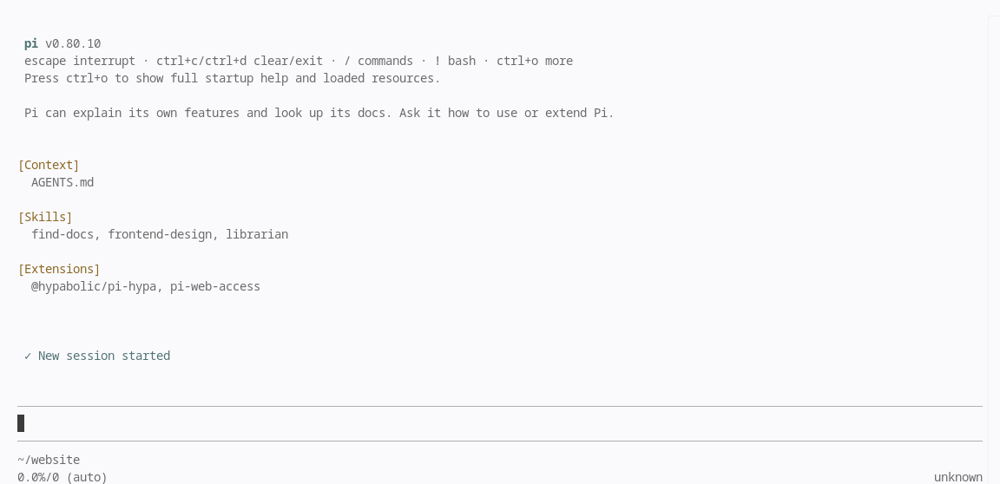

## Schritt 1: Anmeldung

Wenn ihr euch für die Online-Entwicklungsumgebung angemeldet habt, bekommt ihr
beim Eingang des Hackathons einen Zettel mit einem Shortcode. Gebt diesen Code
auf [der Redeem-Seite](../../redeem/) ein, um die Zugangsdaten für eure
Online-Entwicklungsumgebung zu erhalten. Die Zugangsdaten sehen so aus:

```plaintext
Environment 1  (vcenv-local-1)
  Code Server        : XXXXXXXXXX
  Password           : XXXXXXXXXX
  Dev server         : XXXXXXXXXX
  Container shell    : XXXXXXXXXX
```

Ruft den Link bei „Code Server“ im Browser auf und gebt das Passwort ein.





Als Nächstes müsst ihr dem offenen Ordner vertrauen. Klickt oben auf „Manage“
und dann auf „Trust“.





Öffnet nun über das horizontal geteilte Rechteck oben rechts ein Terminal.

Gebt `npm run dev` ein, um den Entwicklungsserver zu starten.



Öffnet den Link bei „Dev server“ aus euren Zugangsdaten, um die Webseite zu
sehen, an der ihr gerade arbeitet.



Öffnet über das Plus-Zeichen ein zweites Terminal, gebt `pi` ein und bestätigt,
dass pi.dev auf den geöffneten Projektordner zugreifen darf.



Wie ihr den Agent sinnvoll steuert, erfahrt ihr im Tutorial
[Mit pi.dev arbeiten](../pi-dev/).
